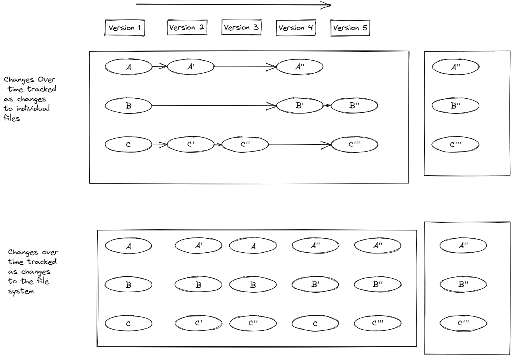
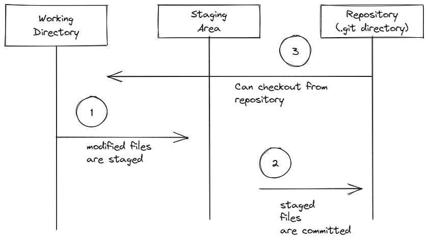

>[Common Home](../README.md)
 
# ProGit Book Notes
 
## Snapshots not differences

The whole repository is available locally.
So version history is a local call.

Files are stored as hash value of the files contents rather the name of the file.

Data is never delete, git only adds to the repository.
This makes it easy to go back in history.

## Git has three stages modified, staged and committed.

### files in modified state
Files have been modified and git had nothing to do with the changes.

### modifications staged
Files have been marked so the changes will go into git.

### staged modifications committed
Safely stored in the git repository

### Working Directory, Staging area, and Git directory

## Command line 

Some commands can only be run on command line.
They are installed on every system that has git.

 

 
>[Common Home](../README.md)