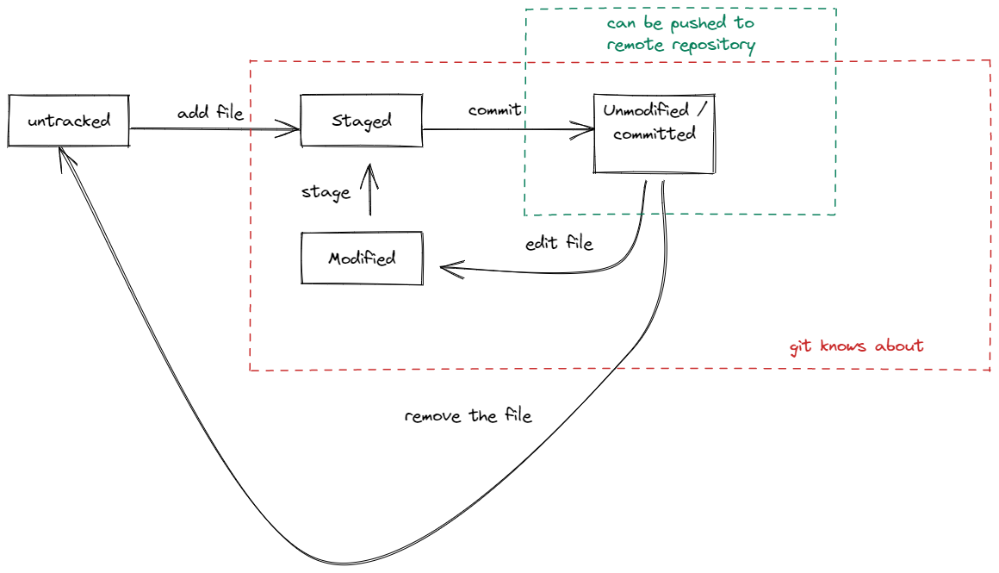

>[Common Home](../README.md)
 
# ProGit Book Notes Introduction

[Book link](https://play.google.com/books/reader?id=imP-LwAAAEAJ&pg)
 
## Snapshots not differences


The whole repository is available locally.
So version history is a local call.

Files are stored as hash value of the files contents rather the name of the file.

Data is never delete, git only adds to the repository.
This makes it easy to go back in history.

## Git has three stages modified, staged and committed.

### files in modified state
Files have been modified and git had nothing to do with the changes.

### modifications staged
Files have been marked so the changes will go into git.


### staged modifications committed
Safely stored in the git repository

### Working Directory, Staging area, and Git directory


## Command line 

Some commands can only be run on command line.
They are installed on every system that has git.

## First time git setup

### See git config and the source of that config

`git config --list --show-origin`


### Setup user name and email

`git config --global user.name "Dharam Veer"`

`git config --global user.email dharam@kuru.com`

### Setup the editor

`git config --global core.editor emacs`

### Default branch name is **main**

 `git config --global init.defaultBranch main`

### Getting help

`get help <verb>`

`git <verb> --help`

### Git help IRC channels

 `#git, #github, or #gitlab`

### Git concise help

`git add -h`

# Git Basics

## Create a new repository

`git init`

## Clone a repository

`git clone <repo location>`

## Recording changes

The `tracked` files are the files that Git knows about, the rest are `untracked` files.



## Checking status

See the current status of files `git status`

Create a file called `README` with some data in it `echo data > README`.

## Tracking new files

To track this new files `git add README`

## Staging modified files

Even for staging modified files, we use the same `git add A`

## Concise git status - Short status

Get concise short status using `git status -s`.

`??` untracked files

`A` staged files

`M` modified files

First column -> Staging Area

Second colum -> Working tree

## Ignoring files

Glob patterns are simplified regular expressions that shells use.

`*`         : zero or more characters.

`[abc]`     : Matches any character inside the brackets

`?`         : Matches a single character

`[0-9]`     : Matches Any character between zero and 9

`a/**/z`    : Matches nested directories.

Some examples

```bash
.gitignore 
# ignore all .a files
*.a

# but do track lib.a, even though you're ignoring .a files above
!lib.a

# only ignore the TODO file in the current directory, not subdir/TODO
/TODO


# ignore all files in any directory named build
build/

# ignore doc/notes.txt, but not doc/server/arch.txt
doc/*.txt

# ignore all .pdf files in the doc/ directory and any of its subdirectories
doc/**/*.pdf

```

## Viewing staged and unstaged changes

We can use `git diff` to see either 
1. What has been committed or
2. What has been staged and ready to be committed, .

You can see what has been committed by just `git diff`.

And, what has been staged and ready to be committed, by doing the following `git diff --staged` or `git diff --cached` commands.

## Commiting your changes

You can then commit your changes by using `git commit`.

To save information about what changes you have made to your repository, you can use the command `git commit -v`.


# Branching


 
>[Common Home](../README.md)